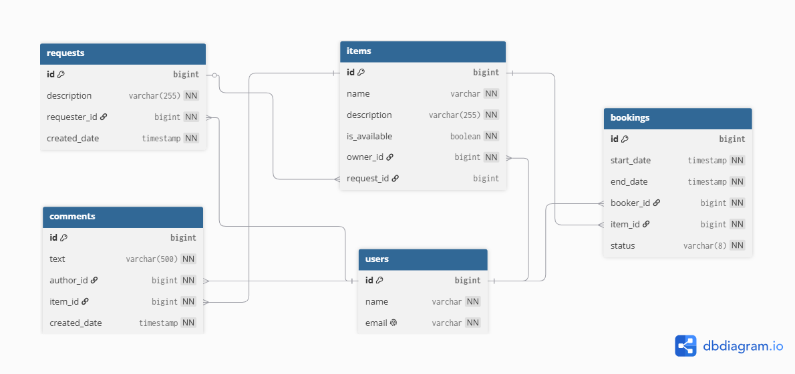

# 🚀 ShareIt
### Сервис шеринга вещей для аренды и совместного использования

**ShareIt** — это платформа, которая решает проблему "где взять вещь на время".
Пользователи могут делиться своими вещами, брать их в аренду на определённые даты,
оставлять отзывы и создавать запросы, если нужной вещи нет в сервисе. Проект реализован
в многомодульной микросервисной архитектуре, что обеспечивает гибкость и масштабируемость.

### Стек: Spring Boot, Hibernate, Spring Data JPA, PostgreSQL, Maven, Docker, JUnit 5, Mockito.

### Система состоит из двух независимых модулей:
1. **Gateway** — сервис-шлюз, отвечающий за валидацию входящих запросов. Принимает все запросы от пользователей,  
проверяет корректность данных (форматы дат, обязательные поля, размеры строк) и перенаправляет валидные запросы 
на основной сервер.

2. **Server** — основной сервер, содержащий всю бизнес-логику и работающий с базой данных. 
Обрабатывает запросы от Gateway, выполняет операции с вещами, бронированиями, отзывами и запросами.

Взаимодействие: Gateway получает запрос от пользователя, проверяет его, отправляет на Server через REST-клиент, 
получает ответ и возвращает пользователю. Такая архитектура позволяет масштабировать Gateway горизонтально 
без изменения основного сервера.

## 🔐 Реализованный функционал
1. Управление вещами: 
- добавление новой вещи.
- редактирование своей вещи
- просмотр списка всех своих вещей.

2. Бронирование вещей:
- создание запроса на бронирование вещи на определённые даты. 
- подтверждение или отклонение запроса на бронирование (только владельцем вещи). 
- просмотр информации о конкретном бронировании (автором бронирования или владельцем вещи). 
- получение списка всех своих бронирований с фильтрацией по статусам. Бронирования сортируются от новых к старым. 
- получение списка бронирований для всех своих вещей с аналогичной фильтрацией по статусам.

3. Отзывы:
- добавление комментария к вещи после завершения аренды (только пользователем, который брал вещь в аренду). 
- просмотр комментариев других пользователей при просмотре вещи.

4. Запросы на добавление вещей:
- создание запроса, если нужная вещь не найдена при поиске. 
- просмотр списка своих запросов вместе с данными об ответах на них. 
- просмотр запросов, созданных другими пользователями. 
- добавление вещи в ответ на запрос другого пользователя.

# Схема базы данных shareit-db

## 🗂️ Модель данных

Основные сущности и их связи:
- **Users** — пользователи системы. 
- **Items** — вещи, доступные для аренды. 
- **Bookings** — бронирования вещей на определённые даты. 
- **Comments** — отзывы на вещи после завершения аренды. 
- **Requests** — запросы на добавление вещей.
